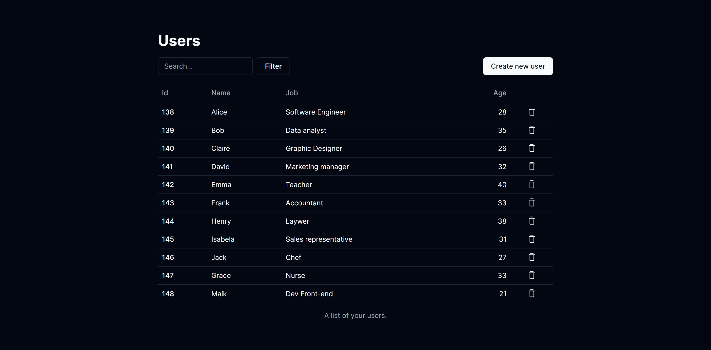

<h1 align="center"> Lista de usuários </h1>

## 🚀 Tecnologias

Esse projeto foi desenvolvido com as seguintes tecnologias:

- [React](https://react.dev/)
- [Next.js](https://nextjs.org/)
- [Typescript](https://www.typescriptlang.org/)
- [Tailwind CSS](https://tailwindcss.com/)
- [ShadcnUI](https://ui.shadcn.com/)
- [react-hook-form](https://react-hook-form.com/)
- [Prisma](https://www.prisma.io/)
- [PostgreSQL](https://www.postgresql.org/)
- Git and GitHub

## 💻 Projeto

Este projeto foi desenvolvido com o objetivo de aprofundar meu entendimento sobre diversos conceitos e tecnologias, incluindo Prisma, PostgreSQL, Route Handlers do Next.js, ShadcnUI para design de interfaces e react-hook-form para manipulação de formulários. Através deste projeto, adquiri experiência prática em trabalhar com bancos de dados, construir aplicações web dinâmicas e aprimorar interfaces de usuário..  

## 🔧 Funcionalidades

- Criar novo usuário;
- Editar informações do usuário;
- Deletar usuário;
- Filtragem de usuário;
- Notificações de Toast;
